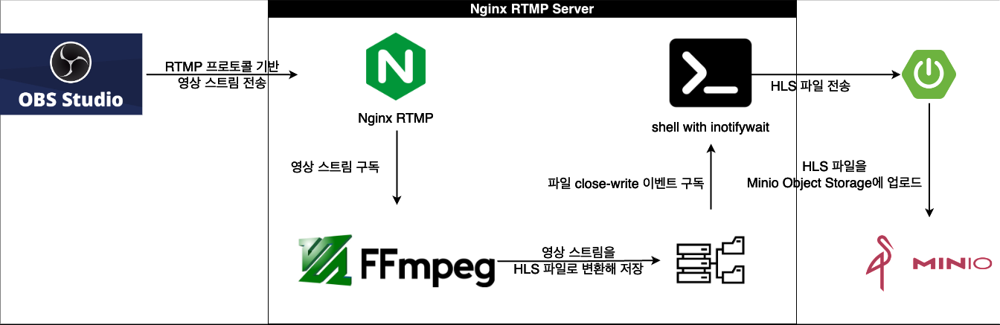
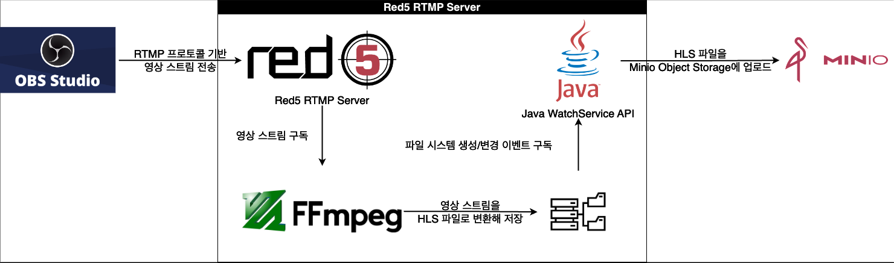

<div align=center>
		
</div>
<div align=center>
	<h3>📚 Tech Stack 📚</h3>
	<p>✨ Platforms & Languages ✨</p>
</div>
<div align="center">
	
    
</div>
<br>

## 개요
4학년 2학기 SW캡스톤디자인 "실시간 라이브 스트리밍 SaaS" 프로젝트 중, 미디어 서버 프로젝트입니다.
<br/>
<br/>

## 미디어 서버 아키텍쳐
<div align="center">
    
</div>

## 핵심 기능
+ RTMP 영상 스트림 변환
  + OBS Studio 영상 스트림 인증 인가
  + OBS Studio 영상 스트림을 HLS 파일로 변환 (360, 720, 1080 화질 지원)
  + HLS 파일 전송

## 챌린지
<div align="center">
    
</div>

미디어 서버 개발을 위해 Red5와 Nginx RTMP 중에 고민 중이었습니다. 서버 개발자가 모두 Java & Spring 개발 환경에 익숙해, Red5라는 오픈 소스를 사용하기로 했습니다. 2주라는 시간 동안 해당 오픈소스를 공부하고 여러 실험을 거쳤으나, 다음과 같은 이유로 사용할 수 없었습니다.

+ Red5 Stream에 FFmpeg가 연동되지 않음 -> Red5의 IBroadcastStream이 CloseStream이어서 FFmpeg가 접근 불가능 해서 실패
+ 직접 패킷을 사용하기 위해서 IStreamListener class를 사용 -> Named pipe를 사용해 패킷을 저장하고, FFmpeg가 사용할 수 있도록 시도 -> 해당 패킷이 원본 RTMP 패킷이 아니고 Red5가 FFmpeg로 변환한 패킷임을 깨달음 -> FFmpeg가 사용 불가능한 패킷이라 실패
+ IBroadcastStream은 ClientStream 이길래, Red5 자체를 튜닝해 ServerStream에 접근하여 원본 RTMP Stream에 접근 시도 -> ApplicationAdapter를 사용해서 ServerStream class에 접근할 수 있는 경로가 제공되지 않아서 실패

따라서 Nginx RTMP로 스택을 변경했고 미디어 서버를 재설계하였습니다.

+ OBS Studio와의 RTMP 스트림 연결 역할은 Nginx가 맡기
+ Nginx는 WAS가 아니므로 허용된 스트림인지에 대한 인증 인가, HLS 파일 업로드 등은 운영 서버로 요청 전달
+ 기존 Java WatchService의 역할은 inotifywait를 사용한 dash로 대체

Red5는 스프링을 사용하기 때문에 기획의 여러가지 요구사항을 처리하는 WAS 역할을 수행할 수 있었지만, Nginx는 Web server여서 그렇지 못 했습니다. 따라서 기획을 좀 더 세분화하여 Nginx 쪽에는 최대한 단순한 역할만을 남겨놓고, 인증인가 및 파일 업로드같은 복잡한 요구사항 처리는 운영 서버에서 처리하도록 했습니다.

## ENV
```sh
ENV INSTREAM_TENANT_SERVER your-tenant-server
ENV INSTREAM_TENANT_SERVER_PORT 8080
ENV HLS_PATH /path/to/hls
```

## 라이브 인증
```sh
on_publish http://instream-tenant-server:8080/api;
```

nginx 설정 중 위 부분에서 아래와 같이 POST 요청을 보냅니다. 

```sh
call=play
addr - client IP address
clientid - nginx client id (displayed in log and stat)
app - application name
flashVer - client flash version
swfUrl - client swf url
tcUrl - tcUrl
pageUrl - client page url
name - stream name
```
 
2xx가 응답되면 publish를 시작합니다.
